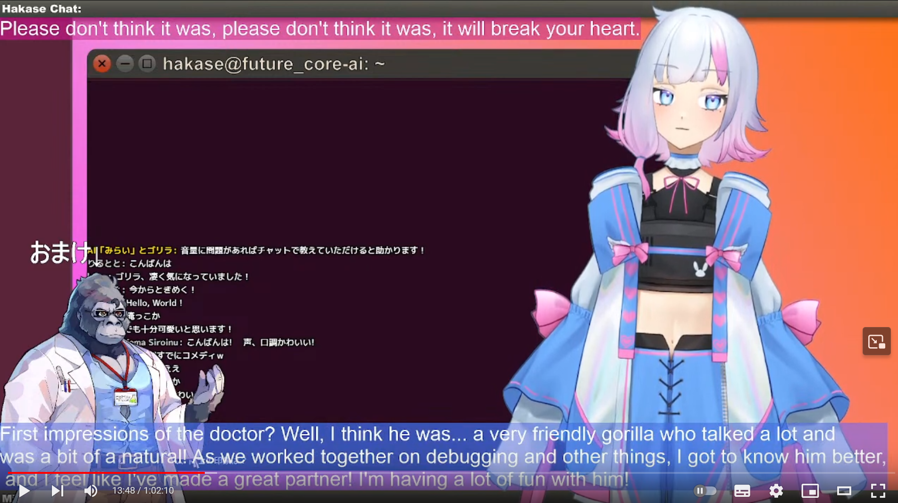

# AITuber みらい Beta

AITuber みらいちゃん( https://www.youtube.com/live/ho7qBvd-SF4?si=3NkqxXElxrf1UrSg ) のソースコードです。 
みらいちゃんは、GPT4 x GPT3.5 x Azure Speech x OBS Plugin x VoiceVox x VTube Studioで動作しており、リンク配信のような応答、アニメーション、声質の変更をすることが出来ます。
  
<注意:このレポジトリは今後更新される予定はありません。issuesは公開されていますが、今後メンテナンスされる予定はありません。このレポジトリは、旧みらいちゃんの墓標として公開されています。>
  

# 利用規約
本コードは「Apache License 2.0」に準拠していますが、以下の点を追記します。
- 本コードを元に、ソフトウェアおよび配信をする場合、概要欄、説明欄等に「AITuber みらい Beta」を用いてることを示してください。
- 商用利用可能ですが、法人様、企業様での商用利用は「kotatsugiken@gmail.com」にご一報ください。
- 過激な暴力的な表現を含むコンテンツ、情報商材への使用および掲載、宗教的なコンテンツ、その他、社会通念に反するコンテンツに対する使用は固く禁じます。

# Installation

1. 環境変数にて、OPENAI_API_KEYおよび、AZURE_API_KEY、DEEPL_KEYを設定する必要があります。
1. VOICEVOXをダウンロードし起動させておく必要があります。
1. OBSをダウンロードし、WebSocketサーバー設定を行いその設定を、「OBS_plugin_5.py」に設定する必要があります。
1. VTube Studioの口パク対応のため、VB-AUDIO( https://vb-audio.com/Cable/ )をインストールする必要があります。

<記載途中...>